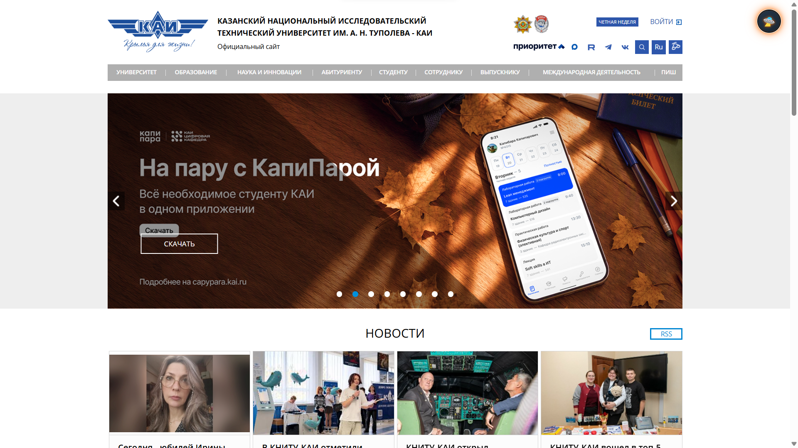
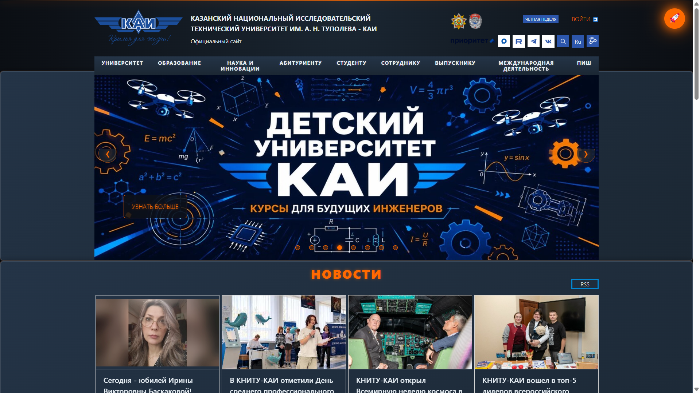
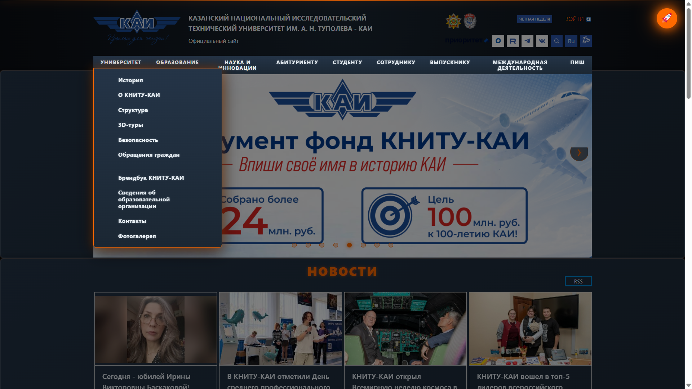
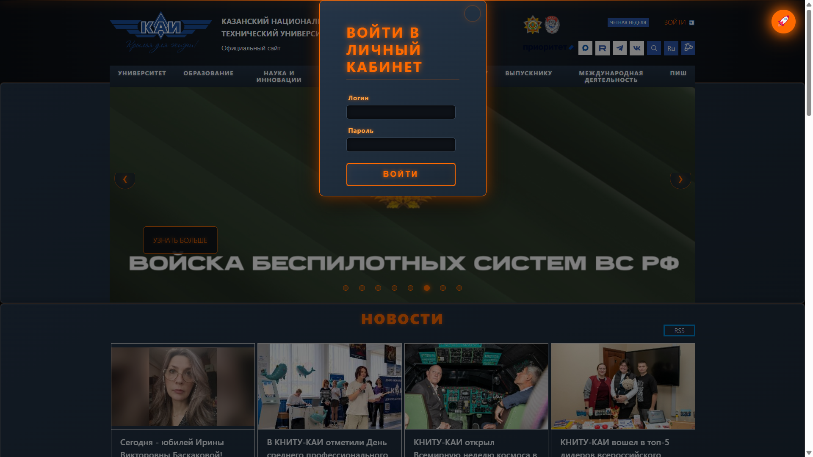
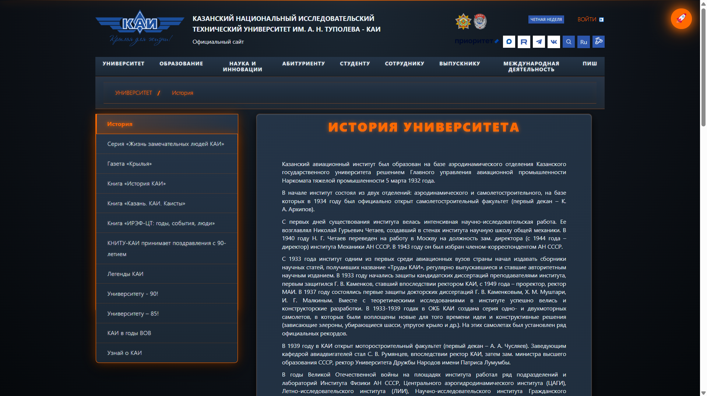
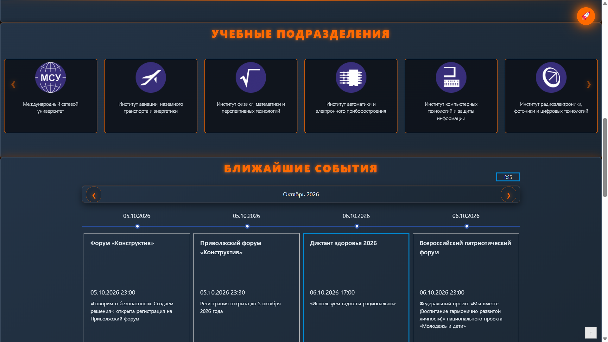

Futurama / New New York Plugin for kai.ru

Плагин для Google Chrome / Yandex Browser, который меняет стиль сайта [kai.ru](https://kai.ru)
в стиле Футурамы — Новый Нью-Йорк 31-го века: металлические серо-голубые поверхности,
неоновые оранжевые акценты и футуристичные «летящие» рамки

Описание проекта

При включении плагина сайт kai.ru полностью меняет оформление:

- Фон страницы — глубокий космический градиент с металлическим серо-голубым отливом
- Акценты — неоновый оранжевый (#ff6a00), как вывески Нового Нью-Йорка
- Заголовки — оранжевые с эффектом неонового свечения и стальной тенью
- Ссылки — оранжевые с glow-эффектом, при наведении — тёплый янтарный
- Карточки новостей — «летящие» панели: серо-голубой металл, скругления, подъём при hover
- Кнопки — тёмные металлические с оранжевой рамкой и свечением
- Верхний блик — тонкая неоновая линия по верхнему краю экрана
- Модальные окна — металлический градиент, скруглённые углы, внутренний блик
- Верхнее меню и подвал — серо-голубой градиент с оранжевой границей
- Стрелки слайдера — стилизованы под неоновые символы `‹` и `›` в круглых кнопках
- Шрифт — гуманистический (Segoe UI / Roboto) вместо моноширинного

Всего изменено более 15 различных стилей (цвета, фоны, границы, отступы, тени, шрифты)

Функциональность

- Кнопка переключения в правом верхнем углу страницы
- Статус стиля отображается эмодзи: 🛸 — выключен, 🚀 — включён
- Сохранение состояния — выбранная тема сохраняется в `localStorage` и восстанавливается после перезагрузки страницы
- Работает на всех страницах kai.ru — главная и внутренние разделы
- CSS-классы — стили применяются через класс `.futurama-mode`, а не через прямое изменение inline-стилей

Инструкция по установке

Установка в Google Chrome
1. Скачай или склонируй папку `style-plugin` из репозитория
2. Открой браузер и перейди по адресу: chrome://extensions/
3. Включи Режим разработчика
4. Нажми кнопку Загрузить распакованное расширение
5. В открывшемся окне выбери папку `style-plugin`
6. Плагин установлен — иконка появится на панели расширений

Использование

1. Открой https://kai.ru
2. В правом верхнем углу появится кнопка 🛸
3. Нажми на неё — стиль включится, эмодзи изменится на 🚀, а сайт станет оранжево-металлическим.
4. Нажми ещё раз — тема отключится
5. Перезагрузи страницу — состояние сохранится автоматически

Скриншоты

До включения плагина

После включения плагина

Структура проекта
style-plugin/
├── manifest.json # Описание расширения
├── content.js # Логика плагина (создание кнопки, переключение, localStorage)
├── readme.md # Документация
└── images/

Технологии и методы

JavaScript:
- `document.getElementById()` — поиск элементов по ID
- `document.querySelector()` — поиск по CSS-селектору
- `document.querySelectorAll()` — поиск нескольких элементов
- `element.parentElement` — родительский элемент
- `element.children` — дочерние элементы
- `localStorage` — сохранение состояния плагина
- Сложный CSS-селектор с двумя классами: `.news_box.active, .card.highlight`

CSS:
- CSS-переменные цвета и градиенты (металлический серо-голубой + неоновый оранжевый)
- `text-shadow` — эффекты неонового свечения вокруг заголовков и ссылок
- `box-shadow` — «летящие» тени и оранжевое свечение панелей
- `linear-gradient` — металлические градиенты поверхностей (145deg, 180deg)
- `radial-gradient` — космический фон страницы
- `transition` — плавные анимации подъёма и свечения
- `border-radius` — футуристичные скругления (6–10px)
- Класс `.futurama-mode` — вместо inline-стилей

Цветовая палитра

| Назначение       | Цвет                              |
|------------------|-----------------------------------|
| Фон (космос)     | `#0d1117`                         |
| Поверхность      | `#1b2733`                         |
| Панели           | `#243447`                         |
| Границы (сталь)  | `#3a4a5c`                         |
| Акцент (неон)    | `#ff6a00`                         |
| Тёплый акцент    | `#ffa040`                         |
| Текст            | `#e6edf3`                         |